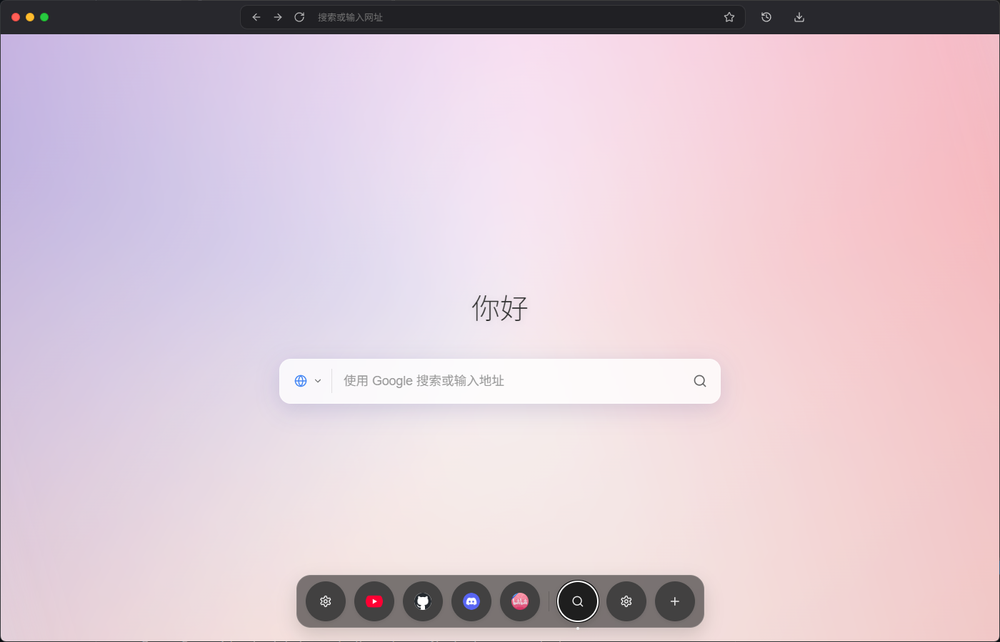
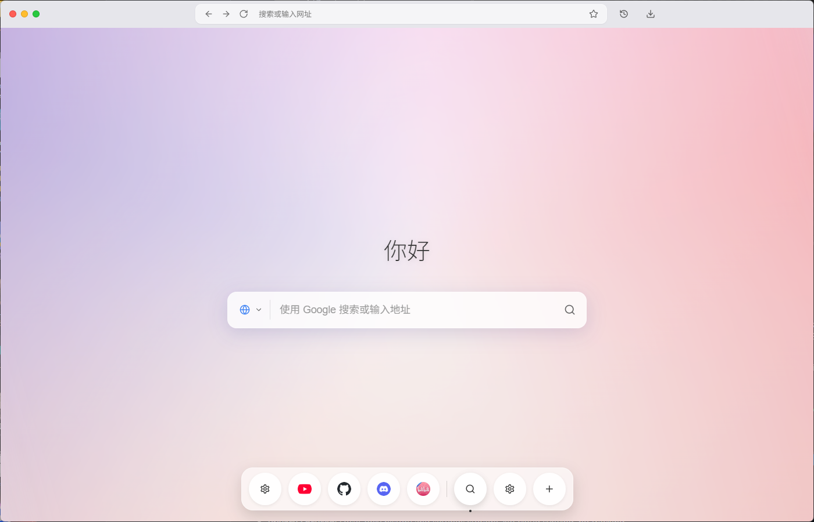
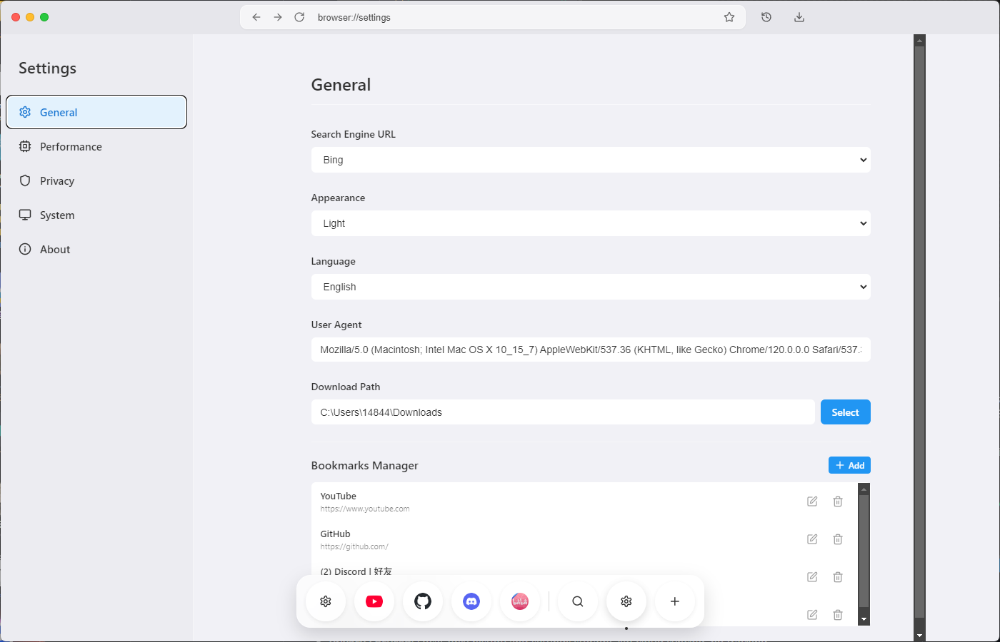

# Lunor (BrowserMos)

<div align="center">


**A Modern, Lightweight, and Transparent Web Browser built with Electron & React.**

[English](#english) | [中文](#chinese)

</div>

---

<a name="english"></a>
## 🇬🇧 English

**Lunor** (codenamed BrowserMos) is a concept web browser designed for minimalism and aesthetic appeal. It features a transparent UI, a macOS-like dock, and essential browsing utilities, all built on the robust Electron framework.

### 📸 Screenshots

<div align="center">
  
  
</div>
<div align="center">
  
</div>

### ✨ Key Features

*   **Glassmorphism UI**: A beautiful, transparent interface that blends with your desktop (customizable themes).
*   **Smart Dock**: An auto-hiding dock for quick access to tabs, bookmarks, and settings.
*   **Tab Management**:
    *   **Live Previews**: Hover over dock items to see real-time previews of your tabs.
    *   **Memory Saver**: Automatically suspends inactive tabs to free up system resources.
*   **Extensions Support**: Install Chrome extensions via CRX/Zip files or unpacked directories. Manage and search extensions with ease.
*   **Privacy Focused**: Local-only history and settings storage. No cloud syncing, no tracking.
*   **Essential Tools**: Built-in History and Downloads manager.
*   **Customization**: Change search engines, themes (Light/Dark/Auto), and font sizes.

### 🛠 Tech Stack

*   **Electron**: For the desktop application runtime.
*   **React**: For the user interface.
*   **Vite**: For fast development and building.
*   **Lucide React**: For beautiful icons.

### 🚀 Getting Started

1.  **Clone the repository**
    ```bash
    git clone https://github.com/WEP-56/Lunor.git
    cd Lunor
    ```

2.  **Install dependencies**
    ```bash
    npm install
    ```

3.  **Run in development mode**
    ```bash
    npm run dev
    ```
    *(Note: This starts both the Vite dev server and the Electron main process)*

4.  **Build for production**
    ```bash
    npm run build
    ```

---

<a name="chinese"></a>
## 🇨🇳 中文 (Chinese)

**Lunor** (开发代号 BrowserMos) 是一款追求极简主义和美学设计的现代网络浏览器。它基于 Electron 和 React 构建，拥有透明的 UI 界面、类似 macOS 的 Dock 栏以及必要的浏览功能。

### ✨ 主要特性

*   **Macos样式**: 精美、现代的用户界面，完美融入您的桌面环境（支持主题自定义）。
*   **智能 Dock 栏**: 自动隐藏的 Dock 栏，可快速访问标签页、书签和设置。
*   **扩展支持**: 支持通过 CRX/Zip 文件或加载已解压的扩展程序安装 Chrome 扩展。提供便捷的扩展管理和搜索功能。
*   **标签页管理**:
    *   **实时预览**: 鼠标悬停在 Dock 图标上即可查看标签页的实时截图预览。
    *   **内存节省模式**: 自动冻结非活动标签页，释放系统资源，让电脑运行更流畅。
*   **隐私至上**: 历史记录和设置仅存储在本地设备上。无云端同步，无追踪。
*   **实用工具**: 内置历史记录和下载管理器。
*   **个性化**: 支持更换搜索引擎、切换主题（浅色/深色/跟随系统）以及调整字体大小。
*   **轻量**: 占用系统资源少，启动速度快，内存占用低，杜绝无用的插件，广告。

### 🛠 技术栈

*   **Electron**: 桌面应用运行环境。
*   **React**: 用户界面库。
*   **Vite**: 极速开发与构建工具。
*   **Lucide React**: 精美图标库。

### 🚀 快速开始

1.  **克隆仓库**
    ```bash
    git clone https://github.com/WEP-56/Lunor.git
    cd Lunor
    ```

2.  **安装依赖**
    ```bash
    npm install
    ```

3.  **开发模式运行**
    ```bash
    npm run dev
    ```

4.  **构建生产版本**
    ```bash
    npm run build
    ```
